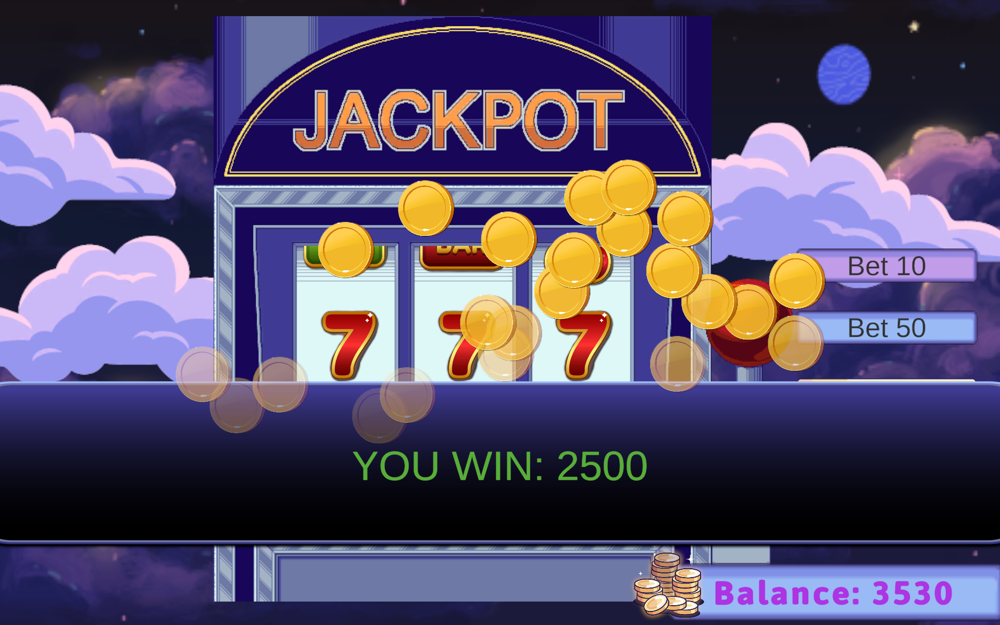
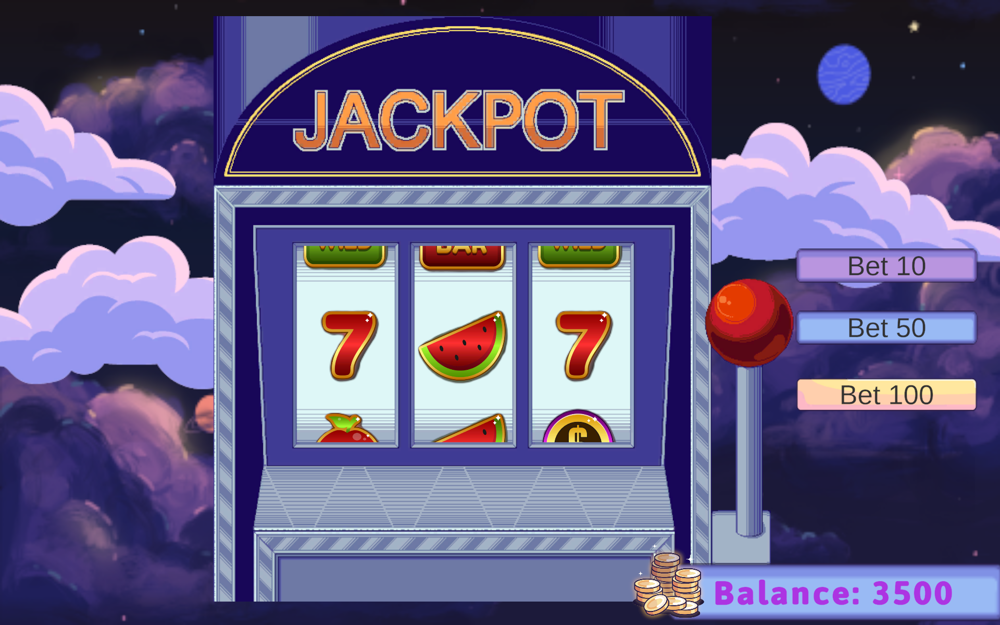
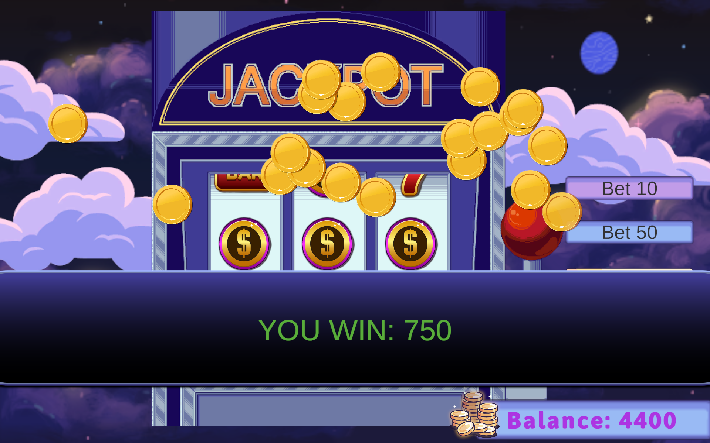

# 🎰 Slot Machine Game

A feature-rich slot machine game built in Unity 6 with smooth reel animations, fair randomization, dynamic win detection, and polished visual feedback systems.

## 📄 Game Overview

This is a classic 3-reel slot machine experience featuring realistic spinning animations, a sophisticated win detection system with multiple payout tiers, and engaging visual/audio feedback. The game implements proper Object-Oriented Programming principles with a clean, modular architecture designed for maintainability and extensibility.

The game demonstrates:

- **Smooth reel animations** with realistic deceleration curves
- **Fair RNG-based outcomes** ensuring unpredictability
- **Multi-tier payout system** with clear win conditions
- **Rich visual feedback** through animations, effects, and camera shake
- **Clean code architecture** with well-organized class structure and meaningful naming

## 📸 Screenshots







_Paste your game screenshots into the `/images` folder and they will display here on GitHub._

## Features

### ✅ Core Features (Assignment Requirements)

- **3-Reel Spinning Action** - Smooth spin animations with smooth deceleration effects matching realistic slot machine behavior
- **Win Logic** - Player wins when all three reels display the same symbol, with clear payout tiers
- **Clean Symbol Display** - Symbols are clearly aligned and visually consistent across all reels
- **Randomized Outcomes** - Proper RNG implementation ensuring fair and unpredictable results
- **Dynamic Win System** - Multiple symbol combinations with distinct payout values
- **Responsive UI** - Clear balance and win displays with real-time updates

### 🌟 Bonus Features (Creative Additions)

- **Wild Card System** - The Wild symbol acts as a universal substitute, creating more dynamic win possibilities
- **Anticipation Mechanic** - When first two reels match, the third reel speeds up, creating dramatic tension (classic casino psychology)
- **Multi-Tier Visual Effects** - Different win magnitudes trigger different feedback intensities (normal, big, mega wins)
- **Camera Shake Feedback** - Proportional screen vibration based on win size, enhancing impact
- **Coin Rain Animation** - Animated coins cascade for visual celebration of wins
- **Symbol Glow & Bounce Effects** - Winning symbols animate with glow and bounce feedback
- **Near-Miss Detection** - 2-of-3 matches trigger subtle feedback, rewarding close calls
- **Hidden Debug Menu** - Press `Ctrl+D` to access testing and simulation tools for development

## How to Play

1. **Start the Game** - Begin with 1000 coins and a default bet of 10
2. **Pull the Lever** - Click the lever to spin the reels
3. **Check Your Win** - Matching symbols trigger payouts with animations
4. **Repeat** - Keep spinning!

## Payout Structure

### Guaranteed Wins

- **3x Seven** = 25x your bet (JACKPOT!)
- **3x Bonus** = 30x your bet (MEGA WIN!)
- **2x Bonus** = 5x your bet

### Symbol Payouts (All Three Match)

| Symbol     | Multiplier |
| ---------- | ---------- |
| Apple      | 6x         |
| Bar        | 10x        |
| Cherry     | 5x         |
| Coin       | 15x        |
| Crown      | 20x        |
| Watermelon | 8x         |
| Wild       | 12x        |

**Wild Card:** The Wild symbol acts as a substitute for any other symbol, making it easier to hit matches.

## Win Tiers & Effects

- **Normal Win** (< 10x bet) - Symbols glow and bounce, 20 coins rain
- **Big Win** (10-20x bet) - Intense bounce, wider coin spread
- **Mega Win** (20x+ bet) - Max effects, 40 coins, dramatic camera shake

## Debug Menu (Testing)

Press **Ctrl+D** to open the hidden debug menu. This gives you access to:

- **Simulate Jackpot** - Instantly land 3x Seven
- **Simulate Mega Win** - Instantly land 3x Crown (30x payout)
- **Simulate Big Win** - Instantly land 3x Coin
- **Simulate Near-Miss** - Land 2x Seven + Apple (for testing camera shake)
- **Add Balance** - Give yourself extra coins to keep playing

Perfect for testing win animations without having to grind spins manually.

## Technical Stack

- **Engine**: Unity 6 (6000.4.4f1)
- **Rendering**: Universal Render Pipeline (URP)
- **Input System**: New Input System (1.19.0)
- **UI Framework**: TextMesh Pro + Canvas system
- **Audio**: AudioSource and AudioClip system
- **Animation**: Coroutine-based system with frame-independent timing

## Project Structure

```
Assets/
├── Scripts/
│   ├── GameManager.cs          # Main game controller and spin logic
│   ├── Reel.cs                 # Individual reel animation and symbol management
│   ├── WinManager.cs           # Win calculation and visual effects
│   ├── AudioManager.cs         # Centralized sound management
│   ├── HandleController.cs     # Lever animation and interaction
│   ├── CameraShake.cs          # Screen vibration effects
│   └── DebugManager.cs         # Hidden debug menu system
├── Sprites/                    # Symbol and UI sprite assets
├── Animations/                 # Animation clips
├── Scenes/                     # Game scenes
└── UI/                         # Canvas and UI prefabs
```

### Code Organization Principles

- **Single Responsibility**: Each class handles one core responsibility (spinning, winning, audio, etc.)
- **DRY (Don't Repeat Yourself)**: Common animation patterns extracted into reusable coroutines
- **Meaningful Naming**: Class and method names clearly describe their purpose
- **Component Decoupling**: Systems communicate through public methods rather than direct property access

## 🧠 Design & Implementation

### Key Architecture

- **Separation of Concerns** - GameManager orchestrates, Reel animates, WinManager detects wins
- **Fair RNG** - Uses `Random.Range()` with balanced symbol rarities
- **Coroutine Animation** - Frame-independent ease-out deceleration for physics
- **Wild Card Logic** - Substitution at win-check time
- **Multi-Tier Effects** - Visual feedback scales with win magnitude

### Code Quality

- Null safety and validation checks
- Constants defined at class top
- Complex logic annotated
- Singleton, enum-based state, component-based design

## 🚀 Running the Game

### Play WebGL Build

1. Navigate to `/Build/WebGL/` in the repository
2. Open `index.html` in a modern web browser
3. The game will load in fullscreen WebGL context
4. Click the lever to start spinning!

### Build & Run Locally

1. Open the project in **Unity 6 (6000.4.4f1)** or later
2. Ensure **New Input System** is installed
3. Open the main scene from `Assets/Scenes/` and press Play

### Build for WebGL

1. Go to File → Build Settings
2. Select WebGL as the target platform
3. Click Build and select the `Build/WebGL` output folder
4. Unity will compile and generate the WebGL build (may take 2-5 minutes)

## ✅ Key Features Met

- ✅ **Winning Logic** - Multi-tier win detection (3-match, 2-match, near-miss)
- ✅ **Fair RNG** - Unity's Random for unpredictable, fair outcomes
- ✅ **Smooth Animations** - Ease-out deceleration for realistic reel physics
- ✅ **Clean Code** - OOP principles, meaningful naming, well-organized structure
- ✅ **Visual Polish** - Symbol glow, bounces, coin rain, camera shake, multi-tier effects
- ✅ **Project Organization** - Scripts, Prefabs, Animations, UI, Sprites properly separated
- ✅ **WebGL Build** - Playable build included in `/Build/WebGL/`

## Performance Notes

The game is optimized for smooth 60fps gameplay:

- Reels use simple sprite swapping instead of mesh deformation
- Coin rain cleans up automatically to prevent memory leaks
- Audio uses single-source playback with one-shots
- No physics bodies needed (all positioned via RectTransform)

---

**Have fun spinning! And remember, in a slot machine, the house always wins... unless you hit that jackpot! 🎰**
